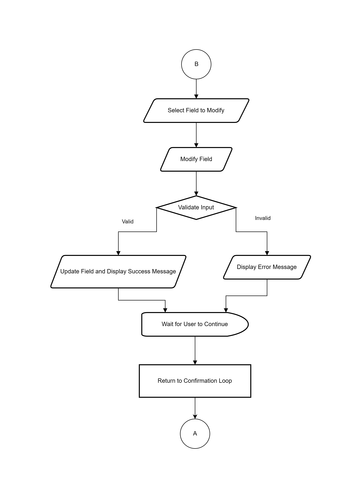
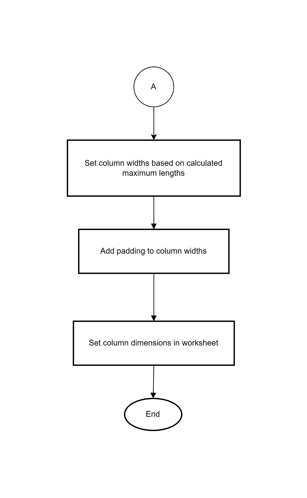
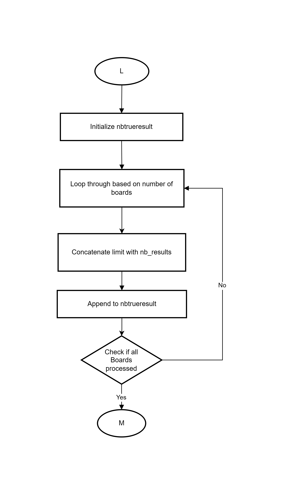
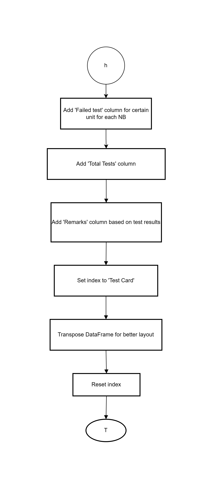

Flowchart Documentation
=======================

Deploy Function
---------------

Clear console function
~~~~~~~~~~~~~~~~~~~~~~

.. image:: _static/clear_console.png
	:alt: clear_console()
	:scale: 25 %
	:align: center
	
Display banner function
~~~~~~~~~~~~~~~~~~~~~~~	
	

	
Thank you banner function
~~~~~~~~~~~~~~~~~~~~~~~	
	
.. image:: _static/thank_you.png
	:alt: thank_you()
	:scale: 25 %
	:align: center
	
Mean shift function
~~~~~~~~~~~~~~~~~~~~

**Part 1**
	

	
**Part 2**

.. image:: _static/mean_shift-Page-2.png
	:alt: mean_shift-Page-2()
	:scale: 25 %
	:align: center
	
Process Dataframe function
~~~~~~~~~~~~~~~~~~~~

**Part 1**
	

	
**Part 2**

.. image:: _static/process_df-Page-2.png
	:alt: process_df-Page-2()
	:scale: 25 %
	:align: center

Get Setup Information function
~~~~~~~~~~~~~~~~~~~~~~~~~~~~~~

**Part 1**
	
.. image:: _static/get_setup_info-Page-1.png
	:alt: get_setup_info-Page-1()
	:scale: 25 %
	:align: center
	
**Part 2**

	
Get Product Information function
~~~~~~~~~~~~~~~~~~~~~~~~~~~~~~

**Part 1**
	
.. image:: _static/get_product_info-Page-1.png
	:alt: get_product_info-Page-1()
	:scale: 25 %
	:align: center
	
**Part 2**

.. image:: _static/get_product_info-Page-2.png
	:alt: get_product_info-Page-2()
	:scale: 25 %
	:align: center
	
Mean Shift Criteria function
~~~~~~~~~~~~~~~~~~~~~~~~~~~~	
	
.. image:: _static/mean_shift_crit.png
	:alt: mean_shift_crit()
	:scale: 25 %
	:align: center
	
Standard Deviation Ratio function
~~~~~~~~~~~~~~~~~~~~~~~~~~~~	
	
.. image:: _static/sd_ratio.png
	:alt: sd_ratio()
	:scale: 25 %
	:align: center
	
Standard Deviation Ratio Criteria function
~~~~~~~~~~~~~~~~~~~~~~~~~~~~	
	
.. image:: _static/sd_ratio_crit.png
	:alt: sd_ratio_crit()
	:scale: 25 %
	:align: center
	
Evaluation based on Mean Shift Criteria and Standard Deviation Ratio Criteria function
~~~~~~~~~~~~~~~~~~~~~~~~~~~~	
	
.. image:: _static/eva_status.png
	:alt: eva_status()
	:scale: 25 %
	:align: center
	
Cp Calculation for Reference Board function
~~~~~~~~~~~~~~~~~~~~~~~~~~~~	
	

Cpk Calculation for Reference Board function
~~~~~~~~~~~~~~~~~~~~~~~~~~~~	
	

	
Cp Calculation for New Board function
~~~~~~~~~~~~~~~~~~~~~~~~~~~~	
	
.. image:: _static/calc_cp_nb.png
	:alt: calc_cp_nb()
	:scale: 25 %
	:align: center
	
Cpk Calculation for New Board function
~~~~~~~~~~~~~~~~~~~~~~~~~~~~	
	
.. image:: _static/calc_cpk_nb.png
	:alt: calc_cpk_nb()
	:scale: 25 %
	:align: center
	
Check Failed test all units function
~~~~~~~~~~~~~~~~~~~~~~~~~~~~~~~~~~~~	
	

	
Autofit columns for generate report function
~~~~~~~~~~~~~~~~~~~~~~~~~~~~~~

**Part 1**
	

	
**Part 2**

	
Main - Data preparation and data processing
-------------------------------------------

Display Banner & Asking Input
~~~~~~~~~~~~~~~~~~~~~~~~~~~~~~~~~~~~	
	
.. image:: _static/main/display_banner.png
	:alt: display_banner.png()
	:scale: 25 %
	:align: center
	
Data process limit file
~~~~~~~~~~~~~~~~	
	

Data initialize Reference Board file
~~~~~~~~~~~~~~~~~~~~~~~~~~~~~~~~	
	
.. image:: _static/main/RB_data_init.png
	:alt: RB_data_init.png()
	:scale: 25 %
	:align: center	
	
Data initialize New Board all units files
~~~~~~~~~~~~~~~~~~~~~~~~~~~~~~~~	

**Part 1**

.. image:: _static/main/NB_data_init_pt1.png
	:alt: NB_data_init_pt1()
	:scale: 25 %
	:align: center
	
**Part 2**

	
Data process for Reference Board and New Board all units files
~~~~~~~~~~~~~~~~~~~~~~~~~~~~~~~~

	
Main - Correlation Report
-------------------------------------------

Calculate Mean and Standard Deviation for Reference Board
~~~~~~~~~~~~~~~~~~~~~~~~~~~~~~~~

**Part 1**

	
**Part 2**

	
Calculate Mean and Standard Deviation for New Board
~~~~~~~~~~~~~~~~~~~~~~~~~~~~~~~~

**Part 1**

	
**Part 2**

	
Create dataframe for limit and RB for all units
~~~~~~~~~~~~~~~~~~~~~~~~~~~~~~~~

.. image:: _static/main/RB_lim_calc.png
	:alt: RB_lim_calc()
	:scale: 25 %
	:align: center
	
Create and Analyzing DataFrames all NBS for all Units
~~~~~~~~~~~~~~~~~~~~~~~~~~~~~~~~

**Part 1**

	
**Part 2**

.. image:: _static/main/RB_NBU_pt2.png
	:alt: RB_NBU_pt2()
	:scale: 25 %
	:align: center
	
**Part 3**

	
Store all NBs based on Unit Results and Overall NBs Status
~~~~~~~~~~~~~~~~~~~~~~~~~~~~~~~~

	
Combine Limits with all NBs Results
~~~~~~~~~~~~~~~~~~~~~~~~~~~~~~~~~~~~

	
Main - Cpk Report
------------------

Combine Unit Results for RB and all NBs into a Single DataFrame respectively
~~~~~~~~~~~~~~~~~~~~~~~~~~~~~~~~~~~~

Calculate Mean for RB and all NBs for DataFrames
~~~~~~~~~~~~~~~~~~~~~~~~~~~~~~~~~~~~~~~~~~~~~~~~

**Part 1**

	
**Part 2**

.. image:: _static/main/mean_rbdf_nbdf_pt2.png
	:alt: mean_rbdf_nbdf_pt2()
	:scale: 25 %
	:align: center

Calculate Standard Deviation for RB and all NBs for DataFrames
~~~~~~~~~~~~~~~~~~~~~~~~~~~~~~~~~~~~~~~~~~~~~~~~

**Part 1**

.. image:: _static/main/std_rbdf_nbdf_pt1.png
	:alt: std_rbdf_nbdf_pt1()
	:scale: 25 %
	:align: center
	
**Part 2**

Combine Mean and Standard Deviation for RB and NBs
~~~~~~~~~~~~~~~~~~~~~~~~~~~~~~~~~~~~~~~~~~~~~~~~~~~~~~~~~~~

.. image:: _static/main/meanstd_rbdf_nbdf.png
	:alt: meanstd_rbdf_nbdf()
	:scale: 25 %
	:align: center

Calculate Cp and Cpk for RB
~~~~~~~~~~~~~~~~~~~~~~~~~~~~~~~~~~~~~~~~~~~~~~~~

.. image:: _static/main/rbcpcpk.png
	:alt: rbcpcpk()
	:scale: 25 %
	:align: center

Calculate Cp and Cpk for NBs
~~~~~~~~~~~~~~~~~~~~~~~~~~~~~~~~~~~~~~~~~~~~~~~~

.. image:: _static/main/nbcpkresult.png
	:alt: nbcpkresult()
	:scale: 25 %
	:align: center
	
Main - Generate Report
----------------------

Create a Correlation Table for Test Results for RB and all NBs
~~~~~~~~~~~~~~~~~~~~~~~~~~~~~~~~~~~~~~~~~~~~~~~~

**Part 1**

	
**Part 2**

Create DataFrames from Product and Setup Information
~~~~~~~~~~~~~~~~~~~~~~~~~~~~~~~~~~~~~~~~~~~~~~~~

Generate output file
~~~~~~~~~~~~~~~~~~~~~~~~~~~~~~~~~~~~~~~~~~~~~~~~

**Part 1**

	
**Part 2**

Display thank you and countdown timer with exit
~~~~~~~~~~~~~~~~~~~~~~~~~~~~~~~~~~~~~~~~~~~~~~~~

